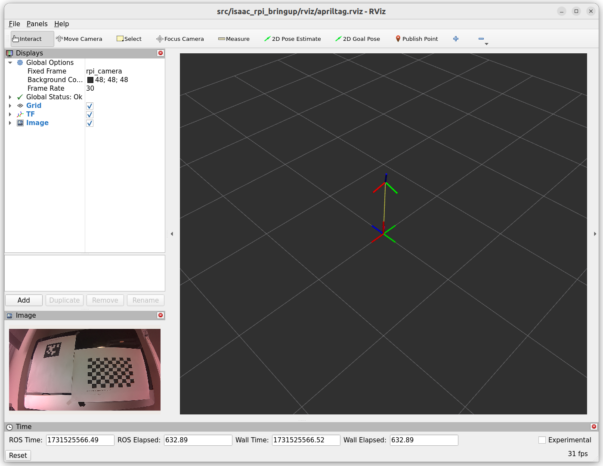

# isaac_rpi_bringup

A simple example showing how to use Raspberry Pi Camera Module 2 (IMX219) on a Jetson Orin Nano with Isaac ROS. 

Tested with JetPack 6.0 and Isaac ROS 3.1 on a Jetson Orin Nano 8GB Dev Kit with a 500GB SSD.

There are 2 launch files:
* [calibrate.py](launch/calibrate.py): bring up `argus::ArgusMonoNode` and `cameracalibrator`
* [apriltag.py](launch/apriltag.py): bring up `argus::ArgusMonoNode`, `image_proc::RectifyNode` and `apriltag::AprilTagNode`

## Prerequisites

The RPi Cam2 should work on the Jetson, e.g., you should see it when you run `nvgstcapture`.

Install JetPack 6.0 and [Isaac ROS](https://nvidia-isaac-ros.github.io/getting_started/index.html) on the Jetson.
These instructions assume that you are using a Docker development environment.

Set up a workspace and clone the `isaac_ros_common` repo as outlined in the first step of the
[isaac_ros_apriltag setup](https://nvidia-isaac-ros.github.io/repositories_and_packages/isaac_ros_apriltag/isaac_ros_apriltag/index.html).

Verify that you can build and run the Docker development environment:
~~~
cd ${ISAAC_ROS_WS}/src/isaac_ros_common && ./scripts/run_dev.sh
~~~
... then exit the container.

## Setup

Clone this repo into your workspace on the Jetson:
~~~
cd ~/workspaces/isaac_ros-dev/src
git clone https://github.com/clydemcqueen/isaac_rpi_bringup
~~~

Copy the `run_dev.sh` config file into $HOME:
~~~
cp isaac_rpi_bringup/.isaac_ros_common-config ~
~~~

Build and run the Docker environment with the additional layer:
~~~
cd ${ISAAC_ROS_WS}/src/isaac_ros_common && ./scripts/run_dev.sh -i ros2_humble.rpi_bringup
~~~

Continuing in the container, run colcon and set up the local environment:
~~~
colcon build --symlink-install
source install/setup.bash
~~~

## April tag detector

Launch the April tag detector:
~~~
ros2 launch isaac_rpi_bringup apriltag.py
~~~

Note: this uses my calibration file, which may throw off the tag poses, but it should still detect the tags.

You can open a 2nd (3rd, ...) terminal and attach to the running container:
~~~
cd ${ISAAC_ROS_WS}/src/isaac_ros_common && ./scripts/run_dev.sh
~~~

You should see the tag detections:
~~~
ros2 topic echo /tag_detections
~~~

If you have a monitor attached you can bring up rviz2 and examine the tf tree:
~~~
rviz2 -d src/isaac_rpi_bringup/rviz/apriltag.rviz
~~~

## Camera calibration

You can launch the ROS2 camera calibrator:
~~~
ros2 launch isaac_rpi_bringup calibrate.py
~~~

Follow the instructions from step 6 in [this camera calibration tutorial](https://docs.nav2.org/tutorials/docs/camera_calibration.html).

Move the yaml file to a reasonable spot and update the [apriltag.py](launch/apriltag.py) launch file with the location.